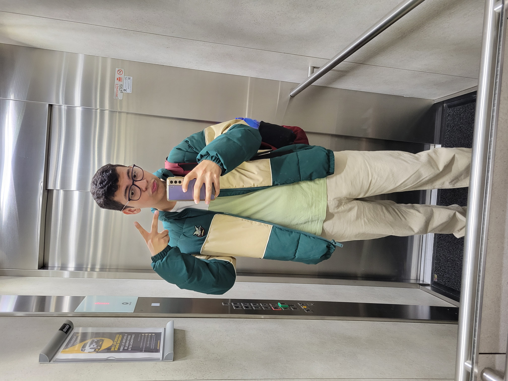

# Roots

ROOTS - La 501 - Equipo 2

## Equipo

### 1. Andrés Perez

### 2. Daniel Fernando Gonzales

### 3. Juan Diego Reyes

### 4. David Ramirez

## Presentacion

🔍 Explora sin límites – Desplázate de forma fluida por una galería de propiedades con imágenes de alta calidad, descripciones detalladas y precios actualizados.

🏠 Filtros avanzados – Encuentra la propiedad perfecta según ubicación, precio, tipo de vivienda, número de habitaciones y más.

📍 Mapa interactivo – Descubre propiedades cercanas en un mapa dinámico para ubicar la mejor opción en tu zona de interés.

💬 Chat en tiempo real – Conéctate directamente con propietarios y agentes inmobiliarios sin salir de la app.

🔔 Notificaciones inteligentes – Recibe alertas personalizadas cuando haya nuevas propiedades que se ajusten a tus criterios de búsqueda.

📄 Gestión de documentos – Accede y administra contratos, certificados y otros documentos importantes desde la aplicación.

Descarga Roots y encuentra tu hogar ideal con un solo scroll. 🌎📲

## Capturas

